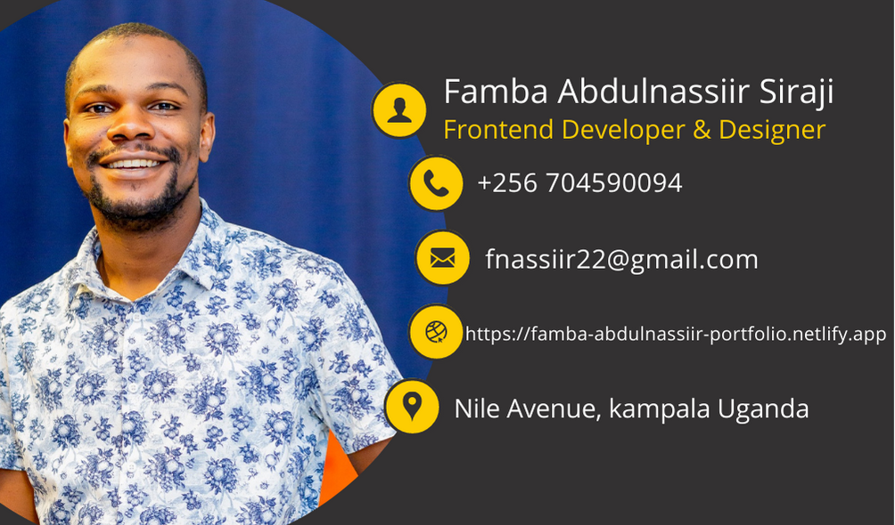

    

# Famba Abdulnassiir Siraji

**`Front-end Developer and Desinger`**

I'm a front-end web developer and designer specializing in clean code and pixel-perfect designs. I create interactive and responsive websites, ensuring accessibility across all devices. With strong soft skills, I collaborate effectively with clients and team members, solving problems and seeking innovative solutions. Currently an IT Officer at UBC, I'm attending the Kanzu Code Foundation Bootcamp Cohort 3 to enhance my skills and stay market-ready. Explore [my portfolio](https://famba-abdulnassiir-portfolio.netlify.app/) to see my creative and technical expertise in action.  
Let's bring your vision to life!

---
## 🧰 Languages and Tools

  

#
## 📊 Stats

## Contact Me
Feel free to reach out to me via:

Email: [fnassiir22@gmail.com](fnassiir22@gmail.com)  
LinkedIn: [Abdulnassiir Famba](https://www.linkedin.com/in/abdulnassiir-famba-87a861100/) 
Twitter: [@FambaSiraji](https://twitter.com/FambaSiraji) 
Whatsapp/Calls: [+256 704590094](https://wa.me/256704590094)

### I'm always open to new opportunities, collaborations, and discussions. Let's connect and create something amazing together!
